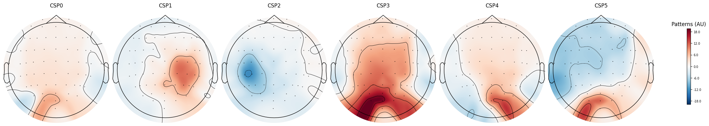

# EEG Motor Imagery Classifier

Classifies imagined left- vs. right-hand movement from EEG using the
[PhysioNet EEG Motor Movement/Imagery Dataset](https://physionet.org/content/eegmmidb/1.0.0/)
(Schalk et al., 2004) — 64-channel EEG recorded with the BCI2000 system while
subjects imagined opening and closing their left or right fist.

## Pipeline

- Load raw EEG (runs 4, 8, 12 — imagined left/right fist) via **MNE-Python**
- Band-pass filter to the mu/beta bands (8–30 Hz)
- Epoch the signal around movement-imagery cues (1–4s post-cue)
- Extract features (log-variance, with and without CSP spatial filtering) and
  classify with **scikit-learn**
- Evaluate with cross-validation, per-subject statistical testing, and a
  channel-restriction confound check

## Results

| Approach | Accuracy |
|---|---|
| Naive log-variance, single subject | 0.38 mean CV (chance) |
| Naive log-variance, pooled (10 subjects) | 0.51 mean CV (chance) |
| CSP (Common Spatial Patterns), single subject | **0.69 mean CV** |
| CSP, one filter pooled across 10 subjects | 0.49 mean CV (chance) |
| CSP, fit per-subject (30 subjects) | 0.53 average (+/- 0.16), range 0.31–0.96 |
| Filter-Bank CSP, single subject (7 bands) | 0.60–0.62 mean CV (underperforms single-band CSP) |
| CSP, motor-area channels only (subject 7) | **0.96 mean CV** — confirms signal is motor-cortex-driven |

*Distribution of CSP cross-validated accuracy across 30 subjects. The
distribution is bimodal — a cluster near or below chance, and a smaller
group scoring well above it — rather than one blob centered on the mean.*

## Why the naive approach fails, and why CSP fixes it

Measuring band power independently at each of the 64 electrodes sits at
chance (0.38–0.51). Motor imagery signal (mu/beta ERD/ERS) is spatially
diffuse — no single electrode captures it cleanly, so per-channel features
have little to work with.

**CSP (Common Spatial Patterns)** fixes this by learning a linear
combination of all 64 electrodes — new "virtual channels" — specifically
chosen to maximize the variance difference between left and right trials.
For a single subject, this alone lifts accuracy from chance to 0.69.

## Why pooling across subjects doesn't work

Fitting *one* CSP filter across pooled data from 10 subjects collapses back
to chance (0.49). CSP is a supervised spatial filter fit to each person's
specific electrode covariance structure — and that structure differs person
to person (skull thickness, cortical folding, electrode contact). One
filter forced to serve everyone converges on a compromise that fits no one
well. Real BCI systems calibrate per-user for exactly this reason.

## Is the group average reliably above chance?

Testing all 30 subjects individually and averaging gives 0.53 — barely above
chance. A **Wilcoxon signed-rank test** on the group vs. 0.5 was **not
significant** (p = 0.70), meaning the group average alone doesn't support a
claim of reliable above-chance decoding.

The histogram shows why: scores aren't clustered around 0.53, they're
bimodal. So instead of one group-level test, each subject was tested
individually with a binomial test on their raw correct/incorrect trial
counts:

**5 of 30 subjects (17%) show statistically significant above-chance
decoding** (p < 0.05): subjects 2, 7, 11, 26, and 29 — with subjects 7 and 29
scoring 43/45 trials correct (p < 0.0001). Several other subjects (1, 10,
15) sat just above the significance threshold (p ≈ 0.07), so the 5/30 count
should be read as approximate given only 45 trials per subject, not exact.

This reframes the finding: motor imagery isn't unreliable for everyone —
it's **reliably decodable for a minority of people** with this pipeline, and
near-chance for the rest. This is consistent with documented **"BCI
illiteracy"** in the literature (commonly estimated at 15–30% of users
showing weak signal), now shown with per-subject statistical evidence rather
than an eyeballed range.

## Where is the signal actually coming from?

The 8–30 Hz band used for CSP contains both the motor mu rhythm (~8–12 Hz,
what we want) and posterior alpha (~8–12 Hz, a visual-cortex idling rhythm
unrelated to hand movement) — these overlap in frequency, so a classifier
could in principle pick up spurious visual/attentional differences between
"imagine left" and "imagine right" trials rather than genuine motor signal.

*CSP spatial patterns for subject 7 (43/45 correct). Some components (e.g.
CSP1) show central sensorimotor topography; others (CSP3–CSP5) show strong
posterior/occipital weighting — raising the possibility of a non-motor
contribution to accuracy.*

**Control test:** re-ran subject 7 using *only* 21 central sensorimotor
electrodes (FC/C/CP rows), deliberately excluding every occipital, frontal,
and temporal channel that could carry a non-motor confound.

**Result: 0.96 mean CV — matching the full 64-channel result almost
exactly**, using less than a third of the electrodes, all directly over the
hand-motor area. This is strong evidence subject 7's decoding genuinely
reflects motor cortex activity rather than a posterior alpha confound.

## Filter-bank experiment (negative result)

Tried splitting the 8–30 Hz range into 7 narrower frequency bands, fitting a
separate CSP filter per band, on the hypothesis that this might isolate a
cleaner signal than one wide band. Result: 0.60–0.62 mean CV, underperforming
single-band CSP (0.69) on the same subject. Likely explanation: with only 45
training examples, 7–14 features (7 bands × 1–2 components) is too many
relative to sample size — added bands introduce noise faster than signal at
this scale. Single-band CSP remains the better choice here; filter-bank
approaches likely need more trials per subject to pay off.

## Limitations

- Small sample per subject (45 epochs), so individual subject scores and
  significance calls carry real sampling variance
- 30 of 109 available subjects used so far
- Only one imagined-movement paradigm (left/right fist) tested

## Next steps

- Scale to more/all subjects to check whether the ~17% significant-decoder
  rate holds
- Hyperparameter tuning (`GridSearchCV`) on CSP component count and k in k-NN
- Compare k-NN vs. logistic regression vs. SVM as the final classifier
- Investigate whether per-subject decodability correlates with anything
  measurable (session length, electrode impedance, trial count)

## How to run

Open `01_motor_imagery_classifier.ipynb` in Google Colab — all dependencies
install in the first cell.
